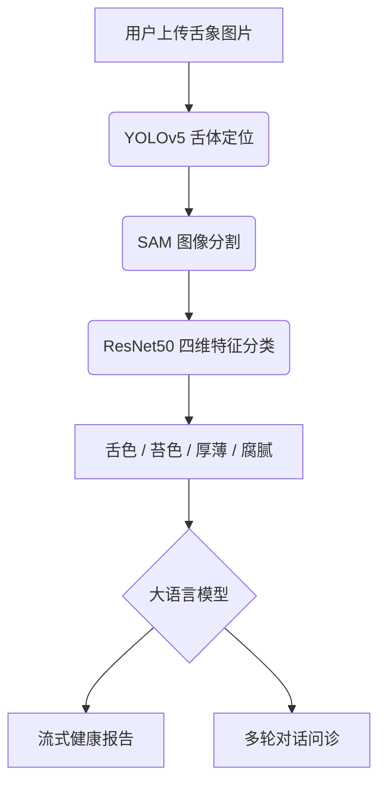

# TongueDiagnosis AI — 中医舌诊 AI 辅助系统 🩺🤖

[](https://www.gnu.org/licenses/agpl-3.0)
[](https://www.python.org/)
[](https://vuejs.org/)
[](https://fastapi.tiangolo.com/)

> 基于深度学习的多模态舌诊分析系统，集成目标检测、图像分割与大语言模型，提供智能中医舌诊与健康建议。

本项目 fork 自 [TonguePicture-SKaRD/TongueDiagnosis](https://github.com/TonguePicture-SKaRD/TongueDiagnosis)，在原版基础上进行了功能扩展与安全加固。

---

## ✨ 新增功能（相比原版）

| 功能 | 说明 |
|------|------|
| 🌐 **在线 LLM 支持** | 新增 OpenAI 兼容 API 后端（支持 StepFun、DeepSeek、OpenAI 等），无需本地 Ollama |
| 🔍 **舌体自动抠图** | YOLOv5 检测 → SAM 分割 → 裁剪保存，前端实时展示抠图结果 |
| 📋 **历史诊断记录** | 修复历史记录加载问题，支持切换查看多次诊断的完整对话 |
| 🔒 **安全加固** | DOMPurify 防 XSS、bcrypt 密码加密、JWT 环境变量密钥、文件上传白名单 |
| 💬 **中文诊断报告** | 系统提示词统一为中文，AI 以中医角度生成结构化调理建议 |
| 👤 **用户信息修复** | 登录后顶栏正确显示用户名（从邮箱前缀提取） |

---

## 📌 核心功能

### 分析流程


### 四维特征识别
- **舌色**：淡红、红、绛、紫等
- **苔色**：白苔、黄苔、灰黑苔等
- **苔厚薄**：薄苔 / 厚苔
- **腐腻度**：腐苔 / 腻苔

---

## 🚀 快速开始

### 环境要求

| 项目 | 最低 | 推荐 |
|------|------|------|
| Python | 3.9 | 3.11 |
| Node.js | 18 | 20 LTS |
| 内存 | 8 GB | 16 GB+ |
| 磁盘 | 10 GB | 20 GB+（含权重） |

### 1. 克隆项目

```bash
git clone https://github.com/cnspica/TongueDiagnosis.git
cd TongueDiagnosis
```

### 2. 后端配置

#### 2.1 创建虚拟环境并安装依赖

```bash
python -m venv venv

# Windows
.\venv\Scripts\activate

# Linux / macOS
source venv/bin/activate

pip install -r requirements.txt
pip install bcrypt
```

#### 2.2 配置环境变量（⚠️ 必须！）

```bash
# 复制模板并填写真实值
cp .env.example .env
```

编辑 `.env`，至少填写以下字段：

```env
# JWT 签名密钥（生产环境必须设置，否则重启后所有用户 Token 失效）
JWT_SECRET_KEY=your-secure-random-key-64-chars

# LLM 后端：openai_compatible（在线）或 ollama（本地）
LLM_BACKEND=openai_compatible

# 使用在线 API 时填写（以 StepFun 为例）
OPENAI_API_BASE=https://chatapi.stepfun.com/chatapi/v1
OPENAI_API_KEY=sk-your-api-key-here
OPENAI_MODEL=step-3.5-flash
```

> 完整变量说明见 [`.env.example`](.env.example)

#### 2.3 创建必要目录

```bash
mkdir -p application/net/weights
mkdir -p frontend/public/tongue
```

#### 2.4 下载模型权重

```bash
# 下载 ResNet50 / U-Net / YOLOv5 权重
wget -P application/net/weights/ \
  "https://github.com/TonguePicture-SKaRD/TongueDiagnosis/releases/download/V1.0_Beta/rot_and_greasy.pth" \
  "https://github.com/TonguePicture-SKaRD/TongueDiagnosis/releases/download/V1.0_Beta/thickness.pth" \
  "https://github.com/TonguePicture-SKaRD/TongueDiagnosis/releases/download/V1.0_Beta/tongue_coat_color.pth" \
  "https://github.com/TonguePicture-SKaRD/TongueDiagnosis/releases/download/V1.0_Beta/tongue_color.pth" \
  "https://github.com/TonguePicture-SKaRD/TongueDiagnosis/releases/download/V1.0_Beta/unet.pth" \
  "https://github.com/TonguePicture-SKaRD/TongueDiagnosis/releases/download/V1.0_Beta/yolov5.pt" \
  "https://dl.fbaipublicfiles.com/segment_anything/sam_vit_b_01ec64.pth"
```

#### 2.5 启动后端

```bash
python run.py
# 默认监听 http://localhost:5000
```

### 3. 前端配置

```bash
cd frontend
npm install
npm run dev
# 开发模式访问 http://localhost:5173
```

生产构建：

```bash
npm run build
npm run preview
```

---

## ⚙️ 配置说明

### 后端环境变量

| 变量名 | 默认值 | 说明 |
|--------|--------|------|
| `JWT_SECRET_KEY` | 自动生成 | JWT 签名密钥，**生产必须手动设置** |
| `LLM_BACKEND` | `openai_compatible` | `openai_compatible` 或 `ollama` |
| `OPENAI_API_BASE` | StepFun 地址 | OpenAI 兼容 API 基础 URL |
| `OPENAI_API_KEY` | **空（必须设置！）** | API 密钥，不能留空 |
| `OPENAI_MODEL` | `step-3.5-flash` | 使用的模型名称 |
| `OLLAMA_PATH` | `http://localhost:11434/api/chat` | Ollama 服务地址 |
| `LLM_NAME` | `qwen3:8b` | Ollama 本地模型名 |
| `APP_PORT` | `5000` | 后端监听端口 |
| `CORS_ORIGINS` | `http://localhost:5173` | 允许的前端域名 |

### 支持的在线 LLM 服务

| 服务 | API Base | 推荐模型 |
|------|----------|----------|
| [StepFun 阶跃星辰](https://platform.stepfun.com/) | `https://chatapi.stepfun.com/chatapi/v1` | `step-3.5-flash` |
| [DeepSeek](https://platform.deepseek.com/) | `https://api.deepseek.com/v1` | `deepseek-chat` |
| [OpenAI](https://platform.openai.com/) | `https://api.openai.com/v1` | `gpt-4o-mini` |

---

## 🏗️ 项目结构

```
TongueDiagnosis/
├── .env.example                 # 环境变量配置模板（安全，可提交）
├── .gitignore                   # Git 忽略规则
├── LICENSE                      # AGPL-3.0 开源协议
├── Readme.md                    # 项目说明文档
├── DEPLOYMENT.md                # 详细部署文档
├── requirements.txt             # Python 依赖
├── run.py                       # 后端启动入口
├── init_db.py                   # 数据库初始化脚本
├── application/                 # 后端 Python 包
│   ├── config/
│   │   └── config.py            # 配置（读取环境变量）
│   ├── core/                    # 核心业务逻辑
│   ├── models/                  # 数据模型与 SQL Schema
│   ├── net/                     # 深度学习推理
│   │   ├── predict.py           # YOLOv5 + SAM + ResNet50 推理管线
│   │   ├── model/               # 模型架构定义
│   │   └── weights/             # 权重文件（不入版本库）
│   ├── orm/                     # SQLAlchemy ORM + CRUD
│   └── routes/                  # FastAPI 路由
│       ├── model_api.py         # 诊断 API
│       ├── ollama_used.py       # LLM 流式对话（Ollama + OpenAI 兼容）
│       └── user_api.py          # 用户认证 API
└── frontend/                    # Vue 3 前端
    ├── src/
    │   ├── views/               # 页面组件
    │   ├── components/          # 通用组件（含 Header.vue）
    │   └── stores/              # Pinia 状态管理
    └── public/
        └── tongue/              # 舌诊图片存储（不入版本库）
```

---

## 🤝 贡献

欢迎 Issue 和 Pull Request！

1. Fork 本仓库
2. 创建功能分支 (`git checkout -b feature/your-feature`)
3. 提交更改 (`git commit -m 'feat: add your feature'`)
4. 推送分支 (`git push origin feature/your-feature`)
5. 开启 Pull Request

---

## 📜 License

本项目遵循 [AGPL-3.0](LICENSE) 协议。

第三方模型权重遵循各自原始协议：
- SAM 模型：[Apache 2.0](https://github.com/facebookresearch/segment-anything/blob/main/LICENSE)
- YOLOv5：[GPL-3.0](https://github.com/ultralytics/yolov5/blob/master/LICENSE)

---

## 致谢

- 原项目：[TonguePicture-SKaRD/TongueDiagnosis](https://github.com/TonguePicture-SKaRD/TongueDiagnosis)
- [Segment Anything Model (SAM)](https://github.com/facebookresearch/segment-anything) — Meta AI Research
- [YOLOv5](https://github.com/ultralytics/yolov5) — Ultralytics
